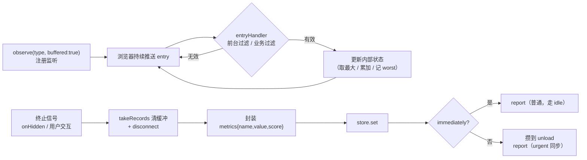
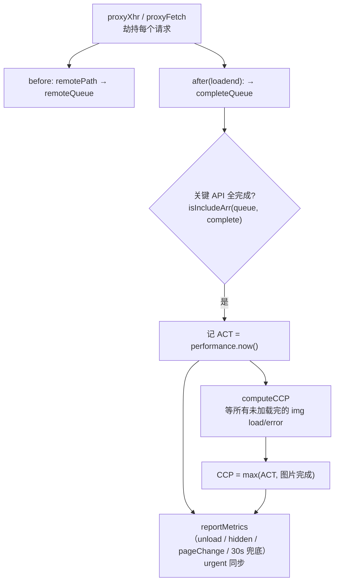

# Web Performance 采集架构

> 本文档梳理 `packages/web-performance` 的采集逻辑：整体流程、核心指标的实现原理、采集基础设施。
> **配合源码 review 阅读**——每个结论都指向对应的源码位置。读文档 → 跳到代码看实现 → 回来对照。

---

## 1. 定位与边界

这个包是一个**纯采集引擎**：

- **职责**：把浏览器零散的性能数据源，统一采集 → 封装成指标 → 通过 `reportCallback` 交给业务。
- **边界**：它**不做网络上报**（发请求是 core / 业务的事）。采集引擎通过一个回调 [`reportCallback`](src/types.ts) 把数据吐出去，自己和 transport 解耦——这样能独立测试、独立复用。

入口是 [`WebVitals`](src/index.ts) 类，业务 `new WebVitals(config)` 即开始采集。

---

## 2. 整体流程

```mermaid
flowchart TD
    Cfg["new WebVitals(config)<br/>生成 sessionId + reporter + store"]编排["index.ts 构造函数编排各指标"]
    编排 -->|"构造时立即"| Env["环境信息<br/>PageInfo / NetworkInfo / DeviceInfo"]
    编排 -->|"构造时立即"| CLS["initCLS"]
    编排 -->|"构造时立即"| LCP["initLCP"]
    编排 -->|"构造时立即"| CCP["initCCP（劫持 fetch/xhr）"]
    编排 -->|"构造时立即"| RT["initResourceTiming（hidden/unload 采慢资源）"]
    编排 -->|"pageshow 事件"| Paint["initFP / initFCP"]
    编排 -->|"load 完成"| Loaded["initNavigationTiming / initINP / initFPS"]
    编排 -->|"beforeunload / unload / onHidden"| Batch["批量 report（urgent 同步）"]

    Env & CLS & LCP & CCP & RT & Paint & Loaded --> Store[("MetricsStore<br/>中央指标仓库")]
    Store --> Reporter["createReporter<br/>普通=idle回调 / 紧急=同步"]
    Reporter --> CB["业务 reportCallback"]
```

**关键点**：不同指标的采集**时机不同**（见 [index.ts](src/index.ts) 编排）：

| 时机 | 指标 | 为什么这个时机 |
|---|---|---|
| 构造立即 | CLS / LCP / CCP / 环境信息 | 这些要尽早注册 observer / 劫持，否则漏采早期事件 |
| `pageshow` | FP / FCP | 绘制发生在 pageshow 后，注册早了也没数据 |
| `load` 完成 | NavigationTiming / INP / FPS | 加载完成后才有完整的瀑布 / 交互 / 稳定帧率 |
| 卸载/隐藏 | 批量 report + RT 采集 | `immediately=false` 时批量上报；RT 也在此时 `getEntriesByType('resource')` 快照 + urgent 上报 |

---

## 3. 性能数据的三个来源

所有指标都在套这三个模板，理解了来源，后面全是填空：

| 来源 | 浏览器 API | 采什么 | 典型指标 |
|---|---|---|---|
| **Navigation Timing** | `performance.getEntriesByType('navigation')` | 页面加载各阶段时间点 | DNS / TCP / TTFB / DOM 解析 |
| **PerformanceObserver** | `new PerformanceObserver(...)` | 浏览器**主动推送**的性能条目 | LCP / FCP / CLS / INP |
| **Resource Timing** | `performance.getEntriesByType('resource')` | 每个资源的加载耗时 | RT（慢资源定位） |
| **运行时计算** | `requestAnimationFrame` / `navigator` / proxy | 浏览器不直接给、要自己算 | FPS、设备信息、CCP |

**第二类（PerformanceObserver）是核心**，也是最容易抄不懂的地方。

---

## 4. PerformanceObserver 指标的通用生命周期

FCP / LCP / CLS / INP 都套这个模式。以 LCP 为例走一遍：



五步里**非显而易见的决策**（这些是照抄学不到的，详见 [§5 基础设施](#5-采集基础设施lib)）：

1. `buffered: true`——脚本可能在加载后期才执行，开它才能拿到"observer 创建前已发生"的条目。
2. `firstHiddenTime` 过滤——后台标签页加载时浏览器节流，测得的值是假的，只采前台事件。
3. 终止时 `takeRecords()` + `disconnect()`——把缓冲区里还没回调的条目一次性取出来，防止丢数据。
4. `onHidden` 当终止点——LCP/CLS/INP 是持续型指标，没有自然完成时刻，用"页面隐藏"兜底。

---

## 5. 采集基础设施（lib/）

| 模块 | 作用 | 关键点 |
|---|---|---|
| [observe.ts](src/lib/observe.ts) | 封装 PerformanceObserver 注册 | 先查 `supportedEntryTypes`，开 `buffered: true` |
| [getFirstHiddenTime.ts](src/lib/getFirstHiddenTime.ts) | 记录页面首次变隐藏的时刻 | 用 getter 动态返回（初始 `Infinity`，隐藏后更新） |
| [onHidden.ts](src/lib/onHidden.ts) | 统一的"页面隐藏"监听 | 同时听 `visibilitychange` + `pagehide`（兼容） |
| [store.ts](src/lib/store.ts) | 指标中央仓库（Map） | `set/get/has/getValues`，批量上报就 `getValues()` |
| [createReporter.ts](src/lib/createReporter.ts) | 把指标封装成 IReportData 交给业务 | **普通**走 `requestIdleCallback`（不阻塞主线程）；**紧急**(unload) 同步回调（否则页面销毁回调永不触发，数据全丢） |
| [proxyHandler.ts](src/lib/proxyHandler.ts) | 劫持 fetch / xhr / history | CCP 用；fetch 的 resource 归一化为 url string（`normalizeResource`） |

---

## 6. 核心指标实现详解

每个指标讲：**定义 → 数据源 → 关键实现 → 终止/上报 → 坑**。

### 6.1 FP / FCP（首次绘制 / 首次内容绘制）

- **定义**：浏览器画出第一个像素 / 第一个 DOM 内容的时刻。
- **数据源**：`observe('paint')`（不支持时降级 `performance.getEntriesByName`）。
- **关键实现**：过滤 `entry.name === 'first-paint'` / `'first-contentful-paint'`，再用 `firstHiddenTime` 只采前台。
- **终止**：paint 是一次性事件，拿到即 `disconnect`。
- **代码**：[getFP.ts](src/metrics/getFP.ts) / [getFCP.ts](src/metrics/getFCP.ts)

### 6.2 LCP（最大内容绘制）

- **定义**：用户首次交互前，视口内最大元素（图/文本）的渲染时间。
- **数据源**：`observe('largest-contentful-paint')`。
- **关键实现**：每次推送都更新 `lcp.value`（浏览器只推"当前最大"），只接受前台事件。
- **终止**：`onHidden` **或** `click`/`keydown`（用户首次交互即定格——这是 LCP 定义的一部分）。
- **坑**：页面秒卸载 / 后台加载时可能没采到 entry，旧实现用 `{}` 初始化 → `startTime` 为 `undefined` → **上报 NaN**。现已改 `undefined` 初始 + guard（[getLCP.ts](src/metrics/getLCP.ts)）。

### 6.3 CLS（累积布局偏移）—— session-window 算法

- **定义**：页面生命周期内最严重的一次"布局不稳定期"。
- **数据源**：`observe('layout-shift')`，排除 `hadRecentInput`（用户输入引起的位移是预期行为）。
- **关键实现（session-window）**：
  - 两次位移间隔 **<1s** 且窗口跨度 **<5s** → 归入同一窗口（累加）。
  - 否则开新窗口。
  - **CLS = 所有窗口里累计值最大的那个**（不是全生命周期累加）。
- **终止**：`onHidden`。
- **坑**：encode 旧实现是全量累加——页面停留越久 CLS 越大（无界计数器），两次无关抖动被叠加。2021 官方改为 session-window。实现抽成纯状态机 `createClsAccumulator`（[getCLS.ts](src/metrics/getCLS.ts)），单测在 [cls.test.ts](src/cls.test.ts)。

### 6.4 INP（交互到下一帧）

- **定义**：页面生命周期内用户交互（点击/按键/触摸）的"输入→下一帧绘制"全链路延迟。
- **数据源**：`observe('event')`，用 `interactionId` 过滤出真正的交互。
- **关键实现**：记录所有交互的 `duration`，取 **worst**。
- **终止**：`onHidden`。
- **坑**：取全局 worst 是简化——官方在长会话（>50 交互）降级到 P98；当前实现长会话会偏高。有意保留（P98 实现复杂、产出小）。
- **背景**：INP 于 2024-03-12 取代 FID 成为 Core Web Vital。FID 只测首次输入，INP 覆盖所有交互。
- **代码**：[getINP.ts](src/metrics/getINP.ts)

### 6.5 FPS（帧率）—— 运行时计算

- **定义**：浏览器每秒重绘的帧数。
- **数据源**：`requestAnimationFrame` 计数（不是 PerformanceObserver）。
- **关键实现**：每满 1s 结算一次 `frame / 实际秒数`，采 `logFpsCount` 次取平均。
- **坑（均已修）**：
  - 计时必须用 `performance.now()`（单调高精度），旧用 `Date.now()` 有时钟跳变风险。
  - 后台 tab 时 rAF 被暂停 → 采不满样本 → Promise 永久 pending。现监听 `visibilitychange`，隐藏时主动结算。
  - 停止条件 `>= count`（修了 off-by-one）。
- **代码**：[calculateFps.ts](src/lib/calculateFps.ts)

### 6.6 CCP（自定义内容绘制）—— 业务可用首屏

这不是标准 Web Vital，是自定义指标：浏览器说"内容画出来了"(FCP/LCP)，但业务数据没回来——**用户真正能用的那一刻**是何时？

派生两个指标：
- **ACT**（api-complete-time）：关键远程 API 全部完成的时刻。
- **CCP**：`max(ACT 完成, 首屏图片加载完成)`。

> 资源流（RL）已从此处剥离，独立为 RT 指标（见 [§6.8](#68-rtresource-timing--慢资源定位)）——resource timing 是通用诊断能力，不属于自定义首屏。



- **机制**：[proxyHandler](src/lib/proxyHandler.ts) 劫持 fetch/xhr，每个请求 before 入 `remoteQueue`、after 入 `completeQueue`；队列匹配后记 ACT，再等首屏 `` 全部 load → CCP。
- **apiConfig**：可配置每个路由要等哪些 API；不配则等所有请求。
- **坑（部分已修）**：
  - ✅ fetch 的 resource 是 Request 对象时归一化为 url（`normalizeResource`），否则 `getApiPath` 崩。
  - ✅ fetch reject 也调 afterHandler（失败请求也算结束，否则 ACT 永远等不到）。
  - ✅ reportMetrics 用 urgent 同步上报（卸载不丢）。
  - 🟡 `remoteQueue`/`isDone`/`reportLock` 是模块级单例状态，多实例会串（单实例无问题，重构待定）。
- **代码**：[getCCP.ts](src/metrics/getCCP.ts)

### 6.7 Navigation Timing（加载瀑布）

- **定义**：页面加载各阶段的耗时分解。
- **数据源**：`observe('navigation')` → 降级 `getEntriesByType('navigation')` → 降级 `performance.timing`。
- **关键实现**：把相邻时间点相减得到各阶段（见 [getNavigationTiming.ts](src/metrics/getNavigationTiming.ts) 顶部注释的瀑布公式）：
  ```
  dnsLookup      = domainLookupEnd   - domainLookupStart
  ttfb           = responseStart     - requestStart
  contentDownload= responseEnd       - responseStart
  domParse       = domInteractive    - responseEnd
  pageLoad       = loadEventStart    - fetchStart
  ...（共 11 个阶段）
  ```

### 6.8 RT（Resource Timing）—— 慢资源定位

- **定义**：定位加载期哪些资源文件慢、各自慢在哪个阶段（不是标准 Web Vital，是诊断能力，回答"是什么慢"的第一块拼图）。
- **数据源**：`performance.getEntriesByType('resource')`（每个资源自带 DNS/连接/TTFB/下载时间点）。
- **判定**：单个资源 `duration >= resourceThreshold`（默认 300ms，**可配**）即视为慢，进入 `slowTop`。不依赖 DNS/网络判定——DNS 是 NavigationTiming 页面级独立采（[§6.7](#67-navigation-timing加载瀑布)），网络仅作快照上下文。
- **数据结构**：每个慢资源带 `stages`（dnsLookup/connection/ssl/ttfb/download 拆解，**跨域无 TAO 时为 null**）、`transferSize`、`initiatorType`、`url`（脱敏去 query/hash）+ 会话 `network` 快照。
- **采集时机**：`hidden/unload` 时 `getEntriesByType('resource')` 快照（entry 累积不清，一次性覆盖整会话），筛 Top-N，urgent 同步上报。
- **跨域处理**：无 `Timing-Allow-Origin` 时阶段时间点全为 0，`stages=null` 只留可信的 `duration`（避免把"拿不到"误读为"很快"）。
- **配置**：`resourceThreshold`（默认 300）、`resourceTopN`（默认 10）。
- **边界**：`downlink`/`effectiveType` 是浏览器对整体下行的估算，network 快照只作参考、不参与判定。
- **代码**：[getResourceTiming.ts](src/metrics/getResourceTiming.ts)，单测在 [getResourceTiming.test.ts](src/getResourceTiming.test.ts)。

---

## 7. 上报时机

两种策略（由 `config.immediately` 控制）：

| 策略 | 行为 | 适用 |
|---|---|---|
| `immediately=true` | 每个指标采到就 report（走 idle 回调） | 实时观察 |
| `immediately=false` | 攒在 store，**卸载/隐藏时** `getCurrentMetrics()` 批量 report | 省请求（默认） |

**卸载上报必须 `urgent`**（同步）：`requestIdleCallback` 在页面销毁后不执行，批量数据会整批丢失。见 [createReporter.ts](src/lib/createReporter.ts) 的 urgent 分流。

### reportCallback 的传输要求（集成契约）

urgent 同步回调只保证「数据同步交到 reportCallback」，**不负责把请求发出去**。卸载时丢不丢数据，取决于集成方在 reportCallback 里用什么 transport：

- ❌ 裸 `fetch` / `XMLHttpRequest`：异步请求，页面卸载时来不及发出 → 丢数据
- ✅ beacon-aware transport（如 core 的 `transportData.send`）：core 已监听 `pagehide` / `visibilitychange`，unload 时自动切 `navigator.sendBeacon`（浏览器保证发出）

所以 web-performance **不自己实现 beacon**（会重复 core、打破"采集引擎不耦合网络"的边界）。集成时把 reportCallback 接到 core.send：

```ts
new WebVitals({
  reportCallback: (data) => coreTransport.send(data), // 走 core 的 beacon-aware send
  immediately: false,
})
```

> 脱离 core 独立使用时，reportCallback 在卸载时机务必用 `navigator.sendBeacon`，否则 unload 数据丢失。

---

## 8. 关键设计决策与已知边界

| 决策 | 理由 |
|---|---|
| 采集引擎不耦合网络 | 只通过 reportCallback 吐数据，可独立测试/复用 |
| `reportCallback` 走 idle | 监控 SDK 不能拖慢被监控页面 |
| 卸载走 urgent 同步 | idle 在页面销毁后不执行，会丢数据 |
| CLS 用 session-window | 对齐 2021 官方定义，旧累加是无界计数器 |
| INP 取全局 worst | 简化（官方 P98 投入大），方向正确 |
| CCP 状态用模块单例 | 简化（单实例下无问题），多实例是已知边界 |
| RT 从 CCP 剥离独立 | resource timing 是通用诊断能力，不属于自定义首屏 |
| RT 阈值可配 | "多慢算慢"无官方规范，业务自定（默认 300ms） |

**卸载可靠性 = 集成契约，不是采集引擎的活**：urgent 同步回调只保证数据同步交到 reportCallback；真正发出请求的可靠性取决于集成方接的 transport。core 已有 `sendBeacon`（unload 自动切换），把 reportCallback 接 `core.send` 即可靠——web-performance 不重复实现 beacon，保住"不耦合网络"的边界。详见 §7「reportCallback 的传输要求」。

---

## 9. 门面集成与应用层定位

web-performance 是**端侧采集层**的独立引擎，不直接给业务方。业务方通过**应用层门面**（`@simple-monitor/web`）消费它——这是 SDK 分层架构（基础层 utils/types → 核心层 core → 端侧采集层 → 门面聚合层 web）的既定设计。

### 门面暴露能力的两种模式

门面集中导出所有能力，但按能力形态分两种暴露方式：

| 模式 | 能力 | 门面怎么做 | 业务方怎么用 |
|---|---|---|---|
| **配置驱动**（自动采集） | browser（错误/HTTP）、**web-performance** | 进 `init({...})`，门面内部启动采集器 | `init({ performance: true })` |
| **API 导出**（框架专属） | vue（插件）、react（组件/函数） | 门面 `re-export` API | `app.use(MonitorVue)` / `<ErrorBoundary>` |

**web-performance 属配置驱动**——业务方不该直接 `new WebVitals`，而是 `init({ performance: true })`，由门面 init 内部启动：

```ts
// packages/web/src/index.ts 的 init 内部（集成待写）
initBrowser(options)                                  // 错误/HTTP/面包屑
new WebVitals({                                       // 性能（配置驱动）
  reportCallback: (data) => transportData.send(data), // 接 core 的 beacon-aware send
  resourceThreshold: options.resourceThreshold,
})
```

vue/react 则属 **API 导出**——门面 `re-export MonitorVue / ErrorBoundary / errorBoundaryReport`，业务方 `import` 后接入框架（`app.use()` / 包裹组件），init 没法替业务方做这步。

### 现状（应用层缺口）

- web 包 [package.json](../web/package.json) **已依赖** web-performance，但 `init` 还没集成（[index.ts](../web/src/index.ts) 注释写"未来"）
- vue/react 包已实现（MonitorVue / ErrorBoundary / errorBoundaryReport），门面也还没 re-export
- 对齐 [框架与设计文档.md](../../框架与设计文档.md) 的门面模式（line 48/59）与"web-performance 复用 core transport"计划（line 272）

> 即：web-performance **采集引擎本身**（采集逻辑 + reportCallback 契约 + 单测）已就绪；把它接进 web 门面 init、连同 vue/react 一起 re-export，是**应用层 part** 的事，不在本采集引擎范围内。
